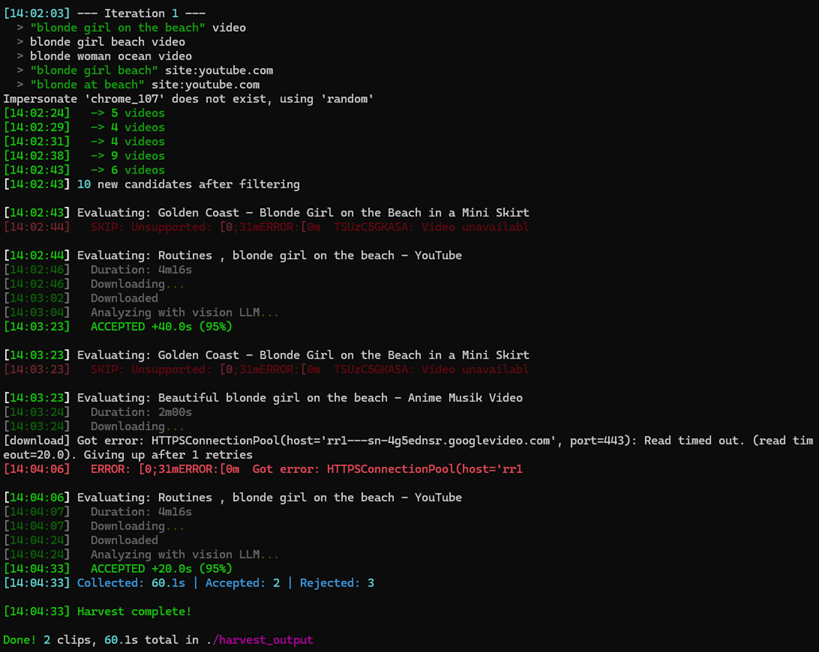

# Lelouch

Agentic web video scraper. Describe what footage you need in natural language, and Lelouch autonomously searches the web, downloads videos, analyzes them with vision AI, and clips the matching segments.

## How it works

1. You describe what you want ("2 minutes of drone footage over mountains")
2. An LLM parses your request and generates search queries with `site:` operators
3. DuckDuckGo text search finds video URLs across platforms
4. yt-dlp downloads each candidate
5. OpenCV extracts keyframes into a grid mosaic
6. A vision LLM analyzes the grid against your criteria
7. ffmpeg clips the matching segments
8. The agent loops — adapting queries based on what worked and what didn't — until it hits your target duration

The LLM steers the entire search strategy. Each iteration, it sees which queries found good content, which got rejected, and why — then generates better queries. It skips platforms that keep failing and avoids duplicate URLs.

## Screenshot



## Requirements

- Python 3.10+
- ffmpeg on PATH
- An LLM API key (OpenAI, Anthropic, Gemini, Groq, OpenRouter, Ollama, etc.)

## Install

```bash
git clone https://github.com/RyukoMatoiFan/lelouch.git
cd lelouch
pip install -e .
```

## Usage

```bash
lelouch
```

This opens a menu:

- **Harvest Videos** — describe footage, watch it scrape
- **Settings** — pick text/vision models and API keys (saved to `settings.yaml`)

Settings auto-save. On next launch, Lelouch loads them from `settings.yaml` in the current directory.

## Supported platforms

YouTube, Vimeo, Rutube, VK Video, Bilibili, TikTok, Twitch, Rumble, Odysee, Streamable, NicoNico, PeerTube — anything yt-dlp supports.

## Supported LLM providers

OpenAI, Anthropic, Google Gemini, xAI, Groq, DeepSeek, Mistral, Z.AI, Ollama (local), OpenRouter — via [LiteLLM](https://github.com/BerriAI/litellm).

## Tests

```bash
pip install -e ".[dev]"
pytest tests/ -q
```

## License

MIT
